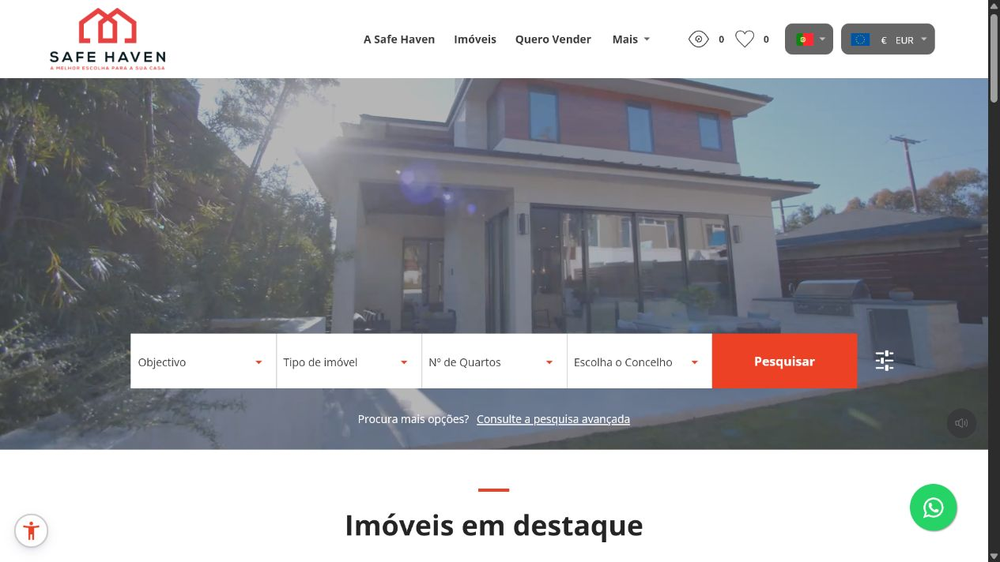
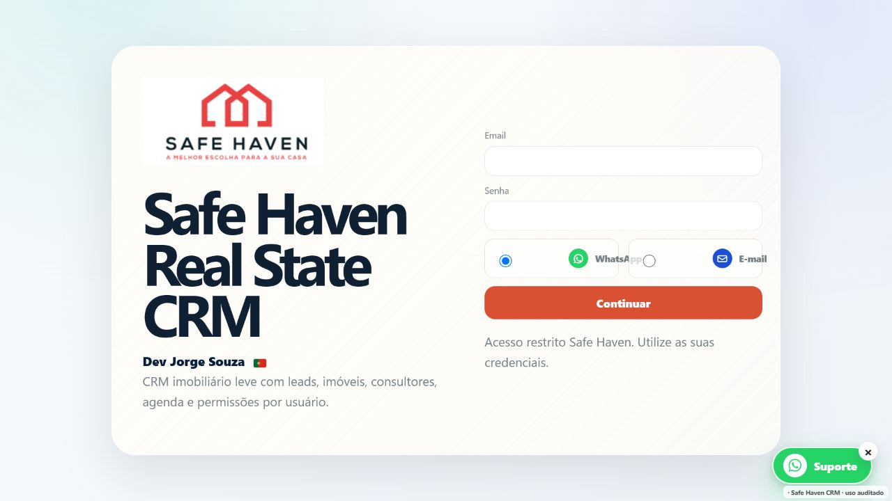
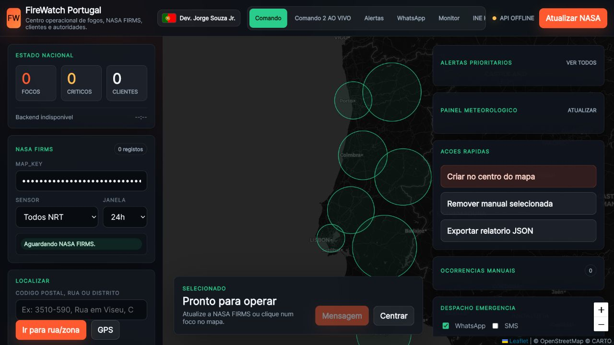

# Jorge Souza Junior

### Desenvolvedor de sistemas · Automação · APIs · Inteligência artificial aplicada

Transformo processos complexos em produtos digitais claros, utilizáveis e orientados à operação.

## Perfil profissional

Sou **Jorge Souza Junior**, desenvolvedor e criador do perfil **SaphirPT**. Projeto soluções web, desktop e mobile para problemas reais de operação, com experiência especialmente forte em **tecnologia imobiliária, automação de processos, dashboards, integrações, inteligência artificial e processamento de documentos**.

O meu trabalho cobre o ciclo completo: entendimento do problema, arquitetura, interface, backend, banco de dados, integrações, implantação em VPS, documentação e evolução do produto.

> Este é um portfólio de apresentação. Por segurança, privacidade e propriedade intelectual, os códigos-fonte, bancos de dados, credenciais, arquivos de clientes e pacotes executáveis permanecem privados.

## Especialidades

| Área | Tecnologias e capacidades |
|---|---|
| Web e APIs | PHP, Python, Flask, Node.js, Express, React, Vite, TypeScript, HTML, CSS, JavaScript e APIs HTTP |
| Desktop | Python, PyQt6, Tkinter, C#/.NET 8, WinForms, WebView2 e aplicações portáteis para Windows |
| Mobile | Kotlin, Android, CameraX, Capacitor, PWA, WebView, Canvas e Material Design |
| IA aplicada | OpenAI, análise multimodal, transcrição, classificação, extração estruturada e assistentes conversacionais |
| Automação | Playwright, PowerShell, Batch, rotinas assistidas, importação e processamento de dados |
| Dados | MySQL, PostgreSQL, SQLite, SQL, JSON, XML, CSV, filtros, indicadores e relatórios |
| Geolocalização e multimédia | OpenStreetMap, Leaflet, mapas, áudio, FFmpeg, imagens 360° e visitas virtuais |
| Entrega | Linux/VPS, Docker, Apache/Nginx, PyInstaller, Nuitka, Gradle, documentação e builds offline |

## Soluções em destaque

### Ecossistema Digital Safe Haven

Plataforma digital para o setor imobiliário, reunindo presença pública, pesquisa de imóveis, CRM, angariação, acompanhamento comercial, dashboards e ferramentas operacionais.

**Minha atuação:** arquitetura do ecossistema, desenvolvimento de módulos, integrações, implantação e evolução contínua.  
**Tecnologias:** PHP, JavaScript, Python, Node.js, APIs, bancos relacionais e Linux/VPS.  
**Estado:** em operação e evolução contínua. · **Código:** privado.

### EVA — Assistente Imobiliária Inteligente

Plataforma de assistência operacional que combina interface desktop, APIs, automação de navegador, voz, análise de intenção, pesquisa de imóveis, relatórios e integrações de atendimento.

**Capacidades:** assistente conversacional, contexto de atendimento, dashboards, voz, webhooks, pesquisa imobiliária e automações X-IMO.  
**Tecnologias:** Python, PyQt6, Flask, Playwright, SQLite, APIs de IA e serviços de voz.  
**Estado:** plataforma avançada; a linha EVA 8 representa um marco de evolução do mesmo produto. · **Código:** privado.

### PT Imóveis e EVA CRM

Soluções de CRM imobiliário para organizar imóveis, clientes, contratos, comissões, consultores, importações X-IMO, acompanhamento comercial e indicadores.

**Capacidades:** autenticação, dashboard, imóveis, clientes, contratos, comissões, perfis, importação e follow-up.  
**Tecnologias:** PHP, SQL, React, Vite, TypeScript, Express, tRPC, MySQL e Drizzle.  
**Estado:** módulos entre MVP funcional e plataforma avançada em consolidação. · **Código:** privado.

### Safe Haven Dollhouse

Aplicação Android para captura 360°, visitas virtuais e representação espacial de imóveis.

**Capacidades:** panorama, navegação estilo Street View, dollhouse 3D, planta 2D, medições, etiquetas, gestão de espaços e minimapa.  
**Tecnologias:** Kotlin, CameraX, WebView, Canvas, Material Design, Gradle e JDK 17.  
**Estado:** protótipo técnico ativo. · **Código:** privado.

### FireWatch Portugal

Centro operacional para reunir e visualizar informação sobre focos de incêndio em Portugal.

**Capacidades:** painel de monitorização, mapa, atualização de dados, integração de fontes, instalação automatizada e distribuição portátil.  
**Tecnologias:** Python, web UI, PowerShell, Batch e integrações opcionais em Docker, PHP e Node.js.  
**Estado:** aplicação operacional documentada. · **Código:** privado.

### EVA Follow-up & Pipeline

Plataforma para acompanhar oportunidades imobiliárias desde a importação até ao retorno do consultor, com fases, resultados de contacto, notas e lembretes automáticos.

**Capacidades:** pipeline comercial, importação XML, histórico, ações de 15 minutos e 1 hora, limites de tentativa e rotinas agendadas.  
**Tecnologias:** PHP, MySQL, Node.js, XML, APIs e cron.  
**Estado:** integração funcional dependente da infraestrutura privada. · **Código:** privado.

### Imobiliária Call Recorder

Arquitetura mobile/PWA para registo assistido de chamadas, funcionamento offline, transcrição e extração estruturada de informação imobiliária.

**Capacidades:** deteção e registo de chamadas, sincronização, Whisper, extração por IA e integração com CRM.  
**Tecnologias:** React, Express, tRPC, MySQL/TiDB, Capacitor e PWA.  
**Estado:** arquitetura e implementação parcial, com privacidade e conformidade como requisitos centrais. · **Código:** privado.

## Dossiê de projetos

### Imobiliário, CRM e operação

| Projeto | Objetivo e principais capacidades | Estado |
|---|---|---|
| **Agenda X-IMO** | Centralizar agenda e tarefas associadas à operação imobiliária e às integrações X-IMO. | Módulo em integração |
| **CRM X-IMO — P&D** | Explorar importadores, automação, sincronização e fluxos complementares ao CRM principal. | Pesquisa e prototipagem |
| **EVA Multi-Portal / SCRAPPING** | Agregar, normalizar e deduplicar imóveis de nove portais, com filtros, mapa, cache e exportação Excel/PDF. | Aplicação avançada |
| **Safe Haven Angariação** | Organizar negócios, documentos, listas, anexos e evolução da angariação. | Módulo funcional |
| **Rotundas Terrenos Suite** | Apoiar pesquisa, triagem e acompanhamento de terrenos e oportunidades por localização. | Solução especializada |
| **Painel de Consultores** | Consolidar informação operacional, indicadores e acompanhamento da equipa comercial. | Dashboard em evolução |
| **Clientes por Valor / Mythos** | Segmentar clientes por valor, indicadores e critérios de pesquisa para apoiar decisões comerciais. | Staging preparado |
| **Safe Haven Escalas** | Gerir escalas semanais, equipa, sorteio de domingos, histórico, relatórios e avisos em versões desktop e web. | Solução multiplataforma |
| **Controle de Chaves** | Registar retirada e devolução de chaves, último responsável, alertas, QR/EAN-13, etiquetas e permissões. | Sistema funcional |
| **Questionários Safe Haven + IA** | Aplicar questionários temáticos, acompanhar progresso e produzir análise assistida e relatórios. | MVP funcional |

### Automação, documentos e produtividade

| Projeto | Objetivo e principais capacidades | Estado |
|---|---|---|
| **Preenchimento Inteligente** | Importar pessoas e documentos, identificar campos, preencher formulários, pré-visualizar e gerar PDFs com revisão humana. | Piloto avançado |
| **Preenchedor de Serviços Online** | Preparar dados e automatizar etapas conhecidas sem contornar CAPTCHA, autenticação, pagamentos ou confirmações legais. | Versão funcional |
| **Transcrição de Contratos** | Converter, segmentar e transcrever áudio para apoiar a criação e organização de documentação. | Fluxo funcional |
| **SISARCH** | Gerir clientes, obras, finanças, prazos, documentos e relatórios de escritórios de arquitetura. | MVP em evolução |
| **EVA Tools Admin** | Administrar licenças, HWID, expiração, proteção e pipelines de build para aplicações EVA. | Ferramenta interna |
| **Python Super Compiler** | Transformar projetos Python em pacotes Windows, com dependências offline, relatórios e hashes de integridade. | Ferramenta operacional |
| **Google Drive Guard** | Adicionar autenticação, sessão e perfis antes do acesso a recursos documentais privados. | Miniaplicação funcional |

### Inteligência, dados e atendimento

| Projeto | Objetivo e principais capacidades | Estado |
|---|---|---|
| **EVA WhatsApp / ZapMiguel** | Atender por WhatsApp com contexto, alternância humano/automático, áudio, risco, intenção e pesquisa de imóveis. | Piloto funcional |
| **Email Reverse Lookup** | Validar e enriquecer endereços de e-mail com sinais de domínio, DNS, website e reputação. | Base modular funcional |
| **Mangualde Photo Locator** | Estimar a localização provável de fotografias com análise multimodal, ranking, coordenadas e mapa. | Aplicação em validação |
| **Social Manager** | Organizar contas, conteúdo, calendário, campanhas e relatórios de redes sociais. | Aplicação local |

## Produtos consolidados

O inventário técnico também contém versões históricas, backups e experiências de laboratório. Para uma apresentação profissional, elas foram consolidadas sob o produto correspondente:

- **EVA 8.x** é apresentado como evolução da plataforma EVA, não como projeto separado.
- **Safe Haven Escalas desktop e web** formam uma única solução multiplataforma.
- **PT Imóveis, EVA CRM e módulos X-IMO** são apresentados pela função de cada produto, evitando duplicidade.
- **Mythos** funciona como laboratório e guarda-chuva de módulos especializados.
- Templates, forks, dependências de terceiros, backups, logs, bases de dados e arquivos de clientes não fazem parte deste portfólio autoral.

## Forma de trabalho

1. Compreender o processo e definir o resultado operacional.
2. Separar interface, regras, dados e integrações.
3. Construir uma versão funcional e verificável.
4. Manter revisão humana nas operações sensíveis.
5. Documentar instalação, utilização, limitações e evolução.
6. Preservar privacidade, credenciais e dados pessoais.
7. Implantar e evoluir os módulos sem comprometer a operação existente.

## Privacidade e propriedade intelectual

As descrições e imagens deste perfil têm finalidade profissional. As imagens utilizam páginas públicas, ecrãs sem autenticação ou dados sanitizados.

**Não são publicados:** código-fonte proprietário, bancos de dados, dumps SQL, documentos e áudios reais, listas de clientes, números de telefone, credenciais, tokens, chaves, cookies, arquivos de configuração, logs, APKs, executáveis ou detalhes de acesso à infraestrutura.

## Contacto

Para propostas, tecnologia imobiliária, automação ou colaboração profissional:

[github.com/SaphirPT](https://github.com/SaphirPT)

**Tecnologia útil, documentação clara e evolução responsável.**

